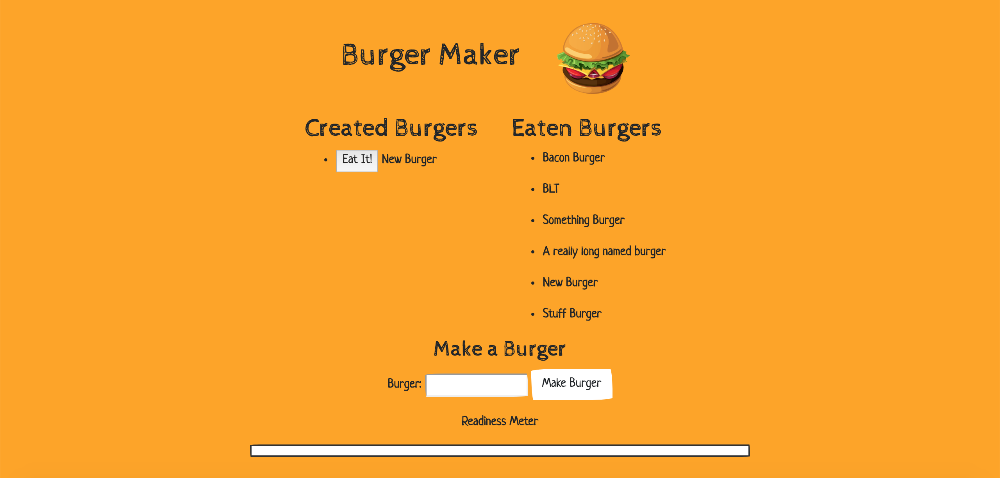

# Burger-Maker
[https://lit-thicket-87558.herokuapp.com/]

## Demonstration

## Table of Contents
* [Description](#description)
* [Installation](#installation)
* [Use](#use)
* [Licensing](#licensing)
* [Contributors](#contributors)
* [Contributing](#contributing)
* [Github](#github) 

## Description
A burger making application that utilizes Node.js, Express, MySQL, Express Handlebars, and Object Relational Mapping to create and "eat" burgers. 
 
## Installation
1. Go to [https://github.com/timothymickiewicz/Burger-Maker] and clone this repository.
2. Open terminal and paste the clone URL into the location where you want this repository.
3. Open this application's directory in your terminal and run `npm install` to install dependancies.
4. Copy and paste this schema with/without the seed data into your MySQL workbench query and execute it to start this database.
5. Run `nodemon server.js` to start the local server.
6. Open this application at [http://localhost:8080/] in your browser of choice. Google Chrome is suggested.

## Use
Visit the live-link at the top of this file to use the application via Heroku.
 
## Licensing

 
## Contributors
Timothy Mickiewicz
* (shields.io) 
* (contributor-covenant.org)
 
## Contributing
 
Please note that this project is released with a Contributor Code of Conduct. By participating in this project you agree to abide by its terms. 
https://www.contributor-covenant.org/version/2/0/code_of_conduct/
 
## Contact
 
timothy.mickiewicz@gmail.com